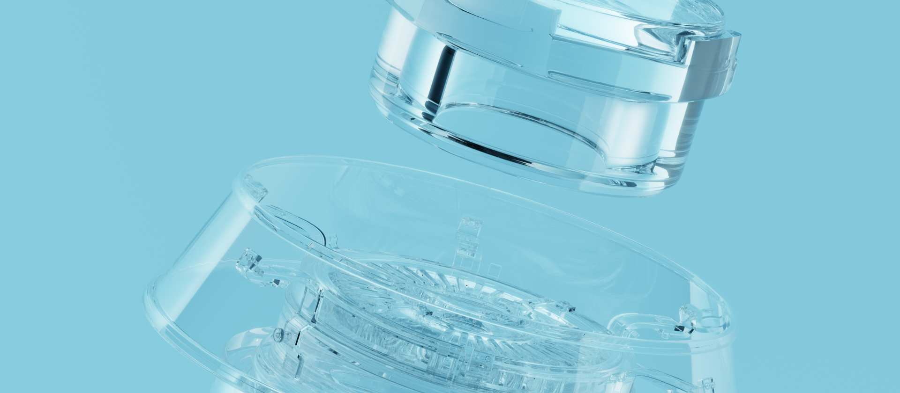

pbrt, Version 4 (Early Release)
===============================



This is an early release of pbrt-v4, the rendering system that will be
described in the (eventually) forthcoming fourth edition of *Physically
Based Rendering: From Theory to Implementation*.  (We hope to have an
online version of the book posted a few months into 2021 and printed books available
in Summer 2021.)

We are making this code available for hardy adventurers; it's not yet
extensively documented, but if you're familiar with previous versions of
pbrt, you should be able to make your away around it.  Our hope is that the
system will be useful to some people in its current form and that any bugs
in the current implementation might be found now, allowing us to correct
them before the book is final.

A number of scenes for pbrt-v4 are [available in a git
repository](https://github.com/mmp/pbrt-v4-scenes).

Features
--------

pbrt-v4 represents a substantial update to the previous version of pbrt-v3.
Major changes include:

* Spectral rendering
  * Rendering computations are always performed using
    point-sampled spectra; the use of RGB color is limited to the scene
    description (e.g., image texture maps), and final image output.
* Modernized volumetric scattering
  * An all-new `VolPathIntegrator` based on the null-scattering path
    integral formulation of [Miller et
    al. 2019](https://cs.dartmouth.edu/~wjarosz/publications/miller19null.html)
    has been added.
  * Tighter majorants are used for null-scattering with the `GridDensityMedium`
    via a separate low-resolution grid of majorants.
  * Emissive volumes are now supported.
* Support for rendering on GPUs is available on systems that have CUDA and OptiX.
  * The GPU path provides all of the functionality of the CPU-based
    `VolPathIntegrator`, including volumetric scattering, subsurface
    scattering, all of pbrt's cameras, samplers, shapes, lights, materials
    and BxDFs, etc.
  * Performance is substantially faster than rendering on the CPU.
* New BxDFs and Materials
  * The provided BxDFs and Materials have been redesigned to be more
    closely tied to physical scattering processes, along the lines of
    Mitsuba's materials. (Among other things, the kitchen-sink UberMaterial
    is now gone.)
  * Measured BRDFs are now represented using [Dupuy and Jakob's
    approach](https://rgl.epfl.ch/publications/Dupuy2018Adaptive).
  * Scattering from layered materials is accurately simulated using Monte
    Carlo random walks (after [Guo et al. 2018](https://shuangz.com/projects/layered-sa18/).)
* A variety of light sampling improvements have been implemented.
  * "Many-light" sampling is available via light BVHs ([Conty and Kulla 2018](http://aconty.com/pdf/many-lights-hpg2018.pdf)).
  * Solid angle sampling is used for triangle
    ([Arvo1995](https://dl.acm.org/doi/10.1145/218380.218500)) and
    quadrilateral ([Ureña et al. 2013](https://www.arnoldrenderer.com/research/egsr2013_spherical_rectangle.pdf))
    light sources.
  * A single ray is now traced for both indirect lighting and BSDF-sampled direct-lighting.
  * Warp product sampling is used for approximate cosine-weighted solid angle
    sampling ([Hart et al. 2019](https://onlinelibrary.wiley.com/doi/abs/10.1111/cgf.14060)).
  * An implementation of Bitterli et al's environment light [portal sampling](https://benedikt-bitterli.me/pmems.html)
    technique is included.
* Rendering can now be performed in absolute physical units with modelling of real cameras as per [Langlands & Fascione 2020](https://github.com/wetadigital/physlight). Code contributed by Anders Langlands & Luca Fascione Copyright © 2020, Weta Digital, Ltd.
* And also...
  * Various improvements have been made to the `Sampler` classes, including
    better randomization and a new sampler that implements pmj02bn sampling ([Christensen et
    al. 2018](https://graphics.pixar.com/library/ProgressiveMultiJitteredSampling/)).
  * A new `GBufferFilm` that provides position, normal, albedo, etc., at
    each pixel is now available. (This is particularly useful for denoising and ML training.)
  * Path regularization (optionally).
  * A bilinear patch primitive has been added ([Reshetov 2019](https://link.springer.com/chapter/10.1007/978-1-4842-4427-2_8)).
  * Various improvements to ray--shape intersection precision.
  * Most of the low-level sampling code has been factored out into
    stand-alone functions for easier reuse.  Also, functions that invert
    many sampling techniques are provided.
  * Unit tests have been substantially increased.

We have also made a refactoring pass throughout the entire system, cleaning
up various APIs and data types to improve both readability and usability.

Finally, pbrt-v4 can work together with the
[tev](https://github.com/Tom94/tev) image viewer to display the image as
it's being rendered.  As of recent versions, *tev* can display images
provided to it via a network socket; by default, it listens to port 14158,
though this can be changed via its ``--hostname`` command-line option.  If
you have an instance of *tev* running, you can run pbrt like:
```bash
$ pbrt --display-server localhost:14158 scene.pbrt
```
In that case, the image will be progressively displayed as it renders.

Building the code
-----------------

As before, pbrt uses git submodules for a number of third-party libraries
that it depends on.  Therefore, be sure to use the `--recursive` flag when
cloning the repository:
```bash
$ git clone --recursive https://github.com/mmp/pbrt-v4.git
```

If you accidentally clone pbrt without using ``--recursive`` (or to update
the pbrt source tree after a new submodule has been added, run the
following command to also fetch the dependencies:
```bash
$ git submodule update --init --recursive
```

pbrt uses [cmake](http://www.cmake.org/) for its build system.  Note that a
release build is the default; provide `-DCMAKE_BUILD_TYPE=Debug` to cmake
for a debug build.

pbrt should build on any system that has C++ compiler with support for
C++17; we have verified that it builds on Ubuntu 20.04, MacOS 10.14, and
Windows 10.  We welcome PRs that fix any issues that prevent it from
building on other systems.

Bug Reports and PRs
-------------------

Please use the [pbrt-v4 github issue
tracker](https://github.com/mmp/pbrt-v4/issues) to report bugs in pbrt-v4.
(We have pre-populated it with a number of issues corresponding to known
bugs in the initial release.)

We are always happy to receive pull requests that fix bugs, including bugs
you find yourself or fixes for open issues in the issue tracker.  We are
also happy to hear suggestions about improvements to the implementations of
the various algorithms we have implemented.

Note, however, that in the interests of finishing the book in a finite
amount of time, the functionality of pbrt-v4 is basically fixed at this
point.  We therefore will not be accepting PRs that make major changes to the
system's operation or structure (but feel free to keep them in your own
forks!).  Also, don't bother sending PRs for anything marked "TODO" or
"FIXME" in the source code; we'll take care of those as we finish polishing
things up.

Updating pbrt-v3 scenes
-----------------------

There are a variety of changes to the input file format and, as noted
above, the new format is not yet documented.  However, pbrt-v4 partially
makes up for that by providing an automatic upgrade mechanism:
```bash
$ pbrt --upgrade old.pbrt > new.pbrt
```

Most scene files can be automatically updated. In some cases manual
intervention is required; an error message will be printed in this case.

The environment map parameterization has also changed (from equi-rect to an
equi-area mapping); you can upgrade environment maps using
```bash
$ imgtool makeenv old.exr --outfile new.exr
```

Using pbrt on the GPU
---------------------

To run on the GPU, pbrt requires:

* C++17 support on the GPU, including kernel launch with C++ lambdas.
* Unified memory so that the CPU can allocate and initialize data
  structures for code that runs on the GPU.
* An API for ray-object intersections on the GPU.

These requirements are effectively what makes it possible to bring pbrt to
the GPU with limited changes to the core system.  As a practical matter,
these capabilities are only available via CUDA and OptiX on NVIDIA GPUs
today, though we'd be happy to see pbrt running on any other GPUs that
provided those capabilities.

pbrt's GPU path currently requires CUDA 11.0 and OptiX 7.1.  The build
scripts will automatically attempt to find a CUDA compiler, looking in the
usual places; the cmake output will indicate whether it was successful.  It
is necessary to manually set the cmake `PBRT_OPTIX7_PATH` configuration
option to point at an OptiX 7.1 install.

Even when compiled with GPU support, pbrt uses the CPU by default unless
the `--gpu` command-line option is given.  Note that when rendering with
the GPU, the `--spp` command-line flag can be helpful to easily crank up
the number of samples per pixel. Also, it's extra fun to use *tev* to watch
rendering progress.

If you'd like to use the OptiX denoiser to denoise rendered images, set the
scene's "Film" type to be "gbuffer" when rendering and use EXR for the
image format; a "deep" image will be generated with auxiliary channels like
albedo and normal that are useful for the denoiser.  The resulting EXR can
be denoised using:
```bash
$ imgtool denoise-optix noisy.exr --outfile denoised.exr
```
